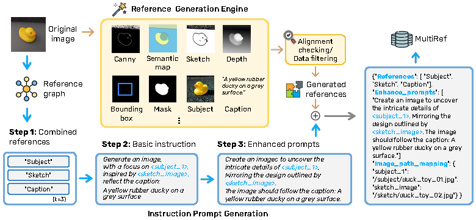

# MultiRef

Project homepage: [https://multiref.github.io/](https://multiref.github.io/)

**MultiRef** introduces the first comprehensive benchmark for evaluating image generation models' ability to combine multiple visual references.




## Introduction
This repository provides an automated data engine and evaluation pipeline for multi-condition image generation tasks. The evaluation pipeline supports various metrics, including FID, Aesthetics, Mask, Caption, Sketch, Subject, Depth, Canny, BBox, Semantic Map, Style, and Pose. Parallel processing is supported for efficient evaluation.

---

## Environment Setup

Before running any code, please create and activate the `multi` environment using the provided `environment.yml`:

```bash
conda env create -f environment.yml
conda activate multi
```

- Python 3.8+ is recommended.
- External dependencies (must be installed manually at the specified locations):
  - Depth-Anything-V2 (`../Depth-Anything-V2/`)
  - Grounded-SAM-2 (`../Grounded-SAM-2/`)
  - Florence-2-large (downloaded automatically by `transformers`)
- Local scripts:
  - All required `.py` files in `../conditions/` (e.g., `to_depth.py`, `to_sketch_new.py`, `to_caption.py`, `to_extrapolation.py`, `to_ground_sam.py`, `to_pose_no_args.py`, etc.)

### External Model Dependencies

To run the evaluation pipeline, you must install the following external models and code in the specified locations (relative to the `MultiRef-code` directory):

#### 1. Grounded-SAM-2 
- **Path:** `../Grounded-SAM-2/`
- **Usage:** generate semantic map, mask, bounding boxes.
- **Install:**
  ```bash
  git clone https://github.com/IDEA-Research/Grounded-SAM-2.git ../Grounded-SAM-2
  ```
  Follow the official instructions to install dependencies and download model weights.

#### 2. Depth-Anything-V2 
- **Path:** `../Depth-Anything-V2/`
- **Usage:** generate depth map.
- **Install:**
  ```bash
  git clone https://github.com/DepthAnything/Depth-Anything-V2.git ../Depth-Anything-V2
  ```
  Follow the official instructions to install dependencies and download model weights.

#### 3. Sketch Model 
- **Path:** `../informative-drawings/`
- **Usage:** generate sketch reference.
- **Install:**
  ```bash
  git clone https://github.com/carolineec/informative-drawings.git ../informative-drawings
  ```
  - Check the code in `to_sketch_new.py` for the expected model file path.
  - Download or copy the model weights to the correct location.
  - Ensure all required Python packages are installed (see `requirements.txt`).

#### 4. Pose Model 
- **Path:** `../HigherHRNet-Human-Pose-Estimation/`
- **Usage:** generate pose reference.
- **Install:**
  ```bash
  git clone https://github.com/HRNet/HigherHRNet-Human-Pose-Estimation.git ../HigherHRNet-Human-Pose-Estimation
  ```
  Follow the official instructions in the [HigherHRNet-Human-Pose-Estimation repository](https://github.com/HRNet/HigherHRNet-Human-Pose-Estimation) to install dependencies and download model weights.

---

## Data Engine Pipeline 

The data engine pipeline generates reference images and condition data for each original image in your dataset. Below is an example for stylebooth dataset using `stylebooth2condition.py`:

### Purpose
- For each original image, generate a set of reference images (e.g., style, semantic map, caption, etc.) and save them in a specified output directory.

### How to Run
We take the StyleBooth dataset as metadata for example. You can use your own data.

```bash
python stylebooth2condition.py
```
- The script will process all images in the dataset directory and generate the corresponding reference images and condition files.
- Input and output directories are specified at the bottom of the script:
  - `base_dataset_path = '../../MetaData/X2I-mm-instruction/stylebooth'`
  - `save_path = '../../Condition_stylebooth'`
- You can modify these paths as needed.

### Output
- For each original image, the pipeline will generate reference images (e.g., style, semantic map, mask, etc.) in the output directory. Besides, for one image, it will generate one json file for detail image paths.
- The output json of each image will follow this structure:

```json
{
    "original_image_path": "<path to original image>",
    "conditions": {
        "semantic_map_path": "<path to semantic map image>",
        "sketch_path": "<path to sketch image>",
        "canny_path": "<path to canny image>",
        "bbox_path": "<path to bbox image>",
        "depth_path": "<path to depth image>",
        "mask_path": "<path to mask image>",
        "caption": "<caption text>",
        "style_path": [
            "<path to style image 1>",
            "<path to style image 2>"
        ]
    }
}
```

---

## Generate Instructions

Before that, you should judge the quality and alignment of generated reference images. The judging structure should follow:
```json
{
    "...":{},
    "judge": {
        "Semantic-Map Alignment": 5,
        "Semantic-Map Quality": 5,
        "Sketch Alignment": 5,
        "Sketch Quality": 5,
        "Canny Alignment": 5,
        "Canny Quality": 5,
        "Bounding-Box Accuracy": 5,
        "Depth Alignment": 5,
        "Depth Quality": 5,
        "Mask Alignment": 5,
        "Caption Alignment": 5
    }
}
```

To generate instructions for your dataset, use `generate_instruction.py`. 

### How to Run
1. At the top of `generate_instruction.py`, set the following environment variables:
   - `SELECT_INPUT_FILE_PATH`: Path to the input file (e.g., a JSON or CSV containing your data entries)
   - `ENHANCED_PROMPTS_OUTPUT_FILE_PATH`: Path to the output file where the enhanced instructions will be saved

Example:
```python
SELECT_INPUT_FILE_PATH = 'your_input.json'
ENHANCED_PROMPTS_OUTPUT_FILE_PATH = 'your_output.json'
```
2. Then run:
```bash
python generate_instructions_new.py
```
The script will read the input file, process the data, and write the enhanced instructions to the output file you specified.


This pipeline ensures that for each original image, you have a full set of reference images and instructions, supporting downstream evaluation and benchmarking tasks.

---

## Benchmark Eval

The benchmark can be downloaded at:
- [Real-world (1k sample)](https://huggingface.co/datasets/wsnHowest/multiref/tree/master)
- [Synthetic (990 sample)](https://huggingface.co/datasets/Dipsy0830/MultiRef/tree/main)

For details on the evaluation pipeline and metrics, see [eval/README.md](./eval/README.md).


